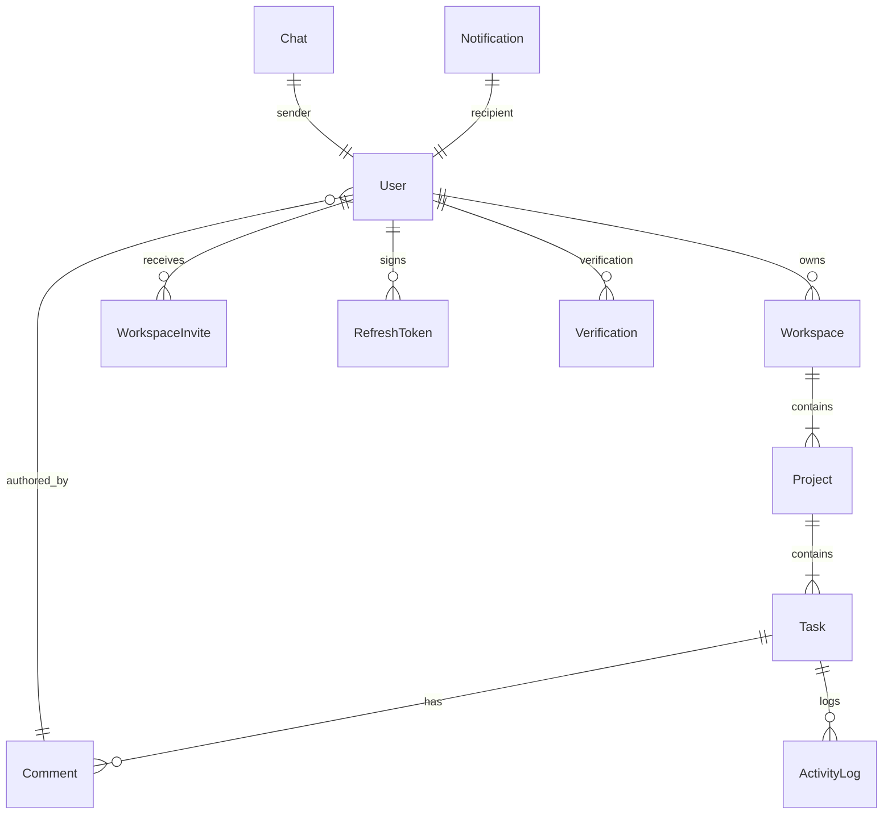

# 🚀 Catalyst System Architecture & Technical Specifications

**Catalyst** is an enterprise-grade backend system designed for project management and collaboration. It provides a highly scalable, robust foundation featuring real-time communication, resilient background processing, advanced security, and role-based permissions.

---

## 📂 Project Overview

Catalyst serves as the backend engine for collaborative workspaces, allowing users to coordinate tasks, communicate in real time, monitor project health, and track activities. The project is organized as a modular Node.js application using ES Modules, backed by MongoDB (with Mongoose ODM) and Redis (for queueing, rate limiting, and token revocation).

### Key Architectural Pillars
1. **Security & Resiliency**: Integrated Rate Limiting, CORS, Helmet headers, NoSQL injection protection, and XSS sanitization.
2. **Modular Domain Design**: Organized into domain-specific modules (Auth, Workspaces, Projects, Tasks, Chats, Notifications) to keep dependencies clean and maintainable.
3. **Background Processing**: Heavy-duty or asynchronous operations (like email deliveries and database cleanups) offloaded to BullMQ with a Redis backend.
4. **Real-time Operations**: Instant notification delivery, project chat, and online presence tracking powered by Socket.io.

---

## ✨ System Features

### 1. Authentication & Security
*   **Dual Token Authentication**: Short-lived JWT access tokens paired with secure HTTP-only refresh tokens stored in database sessions.
*   **Active Sessions Control**: Users can view all active logged-in devices/sessions and revoke them selectively or perform a global logout.
*   **Token Blacklisting**: Revoked access tokens are blacklisted in Redis to enable instant, high-performance O(1) revocation checking.
*   **Role-Based Access Control (RBAC)**: Custom middleware asserting permissions based on hierarchical workspace and project roles.
*   **Advanced Middleware Protection**: Includes protection against NoSQL injection, XSS attacks, and distributed rate limiting configured on sensitive routes (like mailers and auth endpoints).

### 2. Multi-tenant Workspaces & Projects
*   **Workspaces**: Logical containers representing companies, teams, or groups. Users can own, join, or leave multiple workspaces.
*   **Workspace Invites**: Secure invitation flows utilizing cryptographic tokens and expiration checks.
*   **Projects**: Modular work boards containing tags, status tracking (Planning, In Progress, On Hold, Completed, Cancelled), progress metrics, and file attachments.

### 3. Comprehensive Task Management
*   **Task Boards**: Tasks categorized by Status (To Do, In Progress, Review, Done) and Priority (Low, Medium, High).
*   **Collaboration Features**: Assignees, watchers (notified of updates), and nested subtasks.
*   **Time Tracking**: Built-in time log entries to capture actual hours logged against estimates.
*   **Comments & Reactions**: Live task discussions supporting author mentions, attachments, and emoji reactions.

### 4. Background Jobs & Cron Scheduling
*   **Resilient Queues**: BullMQ offloads long-running processes to independent worker threads.
*   **Email Queue**: Sends invitations, verification codes, and alerts asynchronously with automatic exponential-backoff retries.
*   **System Cleanup Queue**: Automatically deletes expired invitations, blacklisted tokens, and stale records.

### 5. Unified Search & Real-time Chat
*   **Unified Search**: Instantly queries workspaces, projects, and tasks using localized index lookups.
*   **Real-time Communication**: Persistent project and workspace chatrooms with instant message history.

---

## 🛠️ Third-Party Libraries

The following third-party dependencies power the Catalyst ecosystem:

| Library | Category | Purpose in Catalyst |
| :--- | :--- | :--- |
| **`express`** | Core | Web framework routing HTTP requests and response pipelines. |
| **`mongoose`** | Database | ODM (Object Data Modeling) for schema definitions, validation, and queries. |
| **`socket.io`** | Real-time | Enables bidirectional WebSocket communication for chat, activities, and notifications. |
| **`redis` / `ioredis`** | Infrastructure | Powers rate limiting, caching, BullMQ job queues, and JWT blacklisting. |
| **`bullmq`** | Background jobs | Handles persistent message queues and background workers. |
| **`zod`** / **`zod-express-middleware`** | Validation | Type-safe runtime schema definitions and request-body/params validation. |
| **`bcrypt`** | Security | Cryptographic hashing for passwords. |
| **`jsonwebtoken`** | Security | Signs and decodes secure Access and Refresh tokens. |
| **`helmet`** | Security | Sets security-focused HTTP headers to protect against common vulnerabilities. |
| **`cors`** | Security | Configures Cross-Origin Resource Sharing rules. |
| **`express-mongo-sanitize`** | Security | Sanitizes user input to block MongoDB Operator Injection attacks. |
| **`xss-clean`** | Security | Filters incoming user input to prevent Cross-Site Scripting (XSS). |
| **`express-rate-limit`** / **`rate-limit-redis`** | Infrastructure | Rate limits endpoints globally and specifically per IP using Redis. |
| **`resend`** | Integration | Sends transactional email updates via the Resend API. |
| **`cloudinary`** / **`multer-storage-cloudinary`** | Integration | Direct storage and retrieval of uploads, avatars, and attachments. |
| **`multer`** | Integration | Handles multi-part form data uploads. |
| **`winston`** / **`winston-daily-rotate-file`** | Observability | Structured log management with daily log-file rotations. |
| **`morgan`** | Observability | Logs HTTP request details, piped directly into Winston logs. |
| **`node-cron`** | Scheduler | Fallback scheduler for repeat background tasks when Redis is offline. |
| **`@faker-js/faker`** | Development | Generates massive mock data to seed the database during testing. |

---

## 🗄️ Database Design

Catalyst utilizes MongoDB with Mongoose schemas. Below are the schema relationships and their data definitions:



### 1. User Schema ([user.js](file:///c:/Users/aN/Desktop/ProjectMang/project-manager-main/backend/modules/auth/models/user.js))
*   **Collection**: `users`
*   **Fields**:
    *   `email` (String, required, unique, lowercase, trimmed)
    *   `password` (String, required, selected `false` by default)
    *   `name` (String, required, trimmed)
    *   `profilePicture` (String)
    *   `isEmailVerified` (Boolean, default: `false`)
    *   `lastLogin` (Date)
    *   `is2FAEnabled` (Boolean, default: `false`)
    *   `twoFAOtp` (String, selected `false` by default)
    *   `twoFAOtpExpires` (Date, selected `false` by default)
    *   `refreshToken` (String, selected `false` by default)
    *   `timestamps` (auto-generated `createdAt` and `updatedAt`)

### 2. Verification Schema ([verification.js](file:///c:/Users/aN/Desktop/ProjectMang/project-manager-main/backend/modules/auth/models/verification.js))
*   **Collection**: `verifications`
*   **Fields**:
    *   `userId` (ObjectId, ref: `User`, required)
    *   `token` (String, required)
    *   `expiresAt` (Date, required)

### 3. RefreshToken Schema ([refresh-token.js](file:///c:/Users/aN/Desktop/ProjectMang/project-manager-main/backend/modules/auth/models/refresh-token.js))
*   **Collection**: `refreshtokens`
*   **Fields**:
    *   `userId` (ObjectId, ref: `User`, required)
    *   `tokenHash` (String, required, unique)
    *   `expiresAt` (Date, required)
    *   `revoked` (Boolean, default: `false`)
    *   `deviceInfo` (Subdocument: `userAgent` String, `ip` String)
*   **Indexes**:
    *   `expiresAt: 1` (TTL Index: `expireAfterSeconds: 0` for automatic deletion)
    *   `tokenHash: 1, revoked: 1` (Compound search optimization)
    *   `userId: 1` (Single-field lookup index)

### 4. BlacklistedToken Schema ([blacklisted-token.js](file:///c:/Users/aN/Desktop/ProjectMang/project-manager-main/backend/modules/auth/models/blacklisted-token.js))
*   **Collection**: `blacklistedtokens`
*   **Fields**:
    *   `token` (String, required, unique, indexed)
    *   `expiresAt` (Date, required)
*   **Indexes**:
    *   `expiresAt: 1` (TTL Index: `expireAfterSeconds: 0` to auto-clear expired blacklisted tokens)

### 5. Workspace Schema ([workspace.js](file:///c:/Users/aN/Desktop/ProjectMang/project-manager-main/backend/modules/workspace/models/workspace.js))
*   **Collection**: `workspaces`
*   **Fields**:
    *   `name` (String, required, trimmed)
    *   `description` (String, trimmed)
    *   `color` (String, default: `"#FF5733"`)
    *   `owner` (ObjectId, ref: `User`, required)
    *   `members` (Array of Subdocuments):
        *   `user` (ObjectId, ref: `User`)
        *   `role` (String, enum: `["owner", "member", "admin", "viewer"]`, default: `"member"`)
        *   `joinedAt` (Date, default: `Date.now`)
    *   `projects` (Array of ObjectIds, ref: `Project`)

### 6. WorkspaceInvite Schema ([workspace-invite.js](file:///c:/Users/aN/Desktop/ProjectMang/project-manager-main/backend/modules/workspace/models/workspace-invite.js))
*   **Collection**: `workspaceinvites`
*   **Fields**:
    *   `user` (ObjectId, ref: `User`, required)
    *   `workspaceId` (ObjectId, ref: `Workspace`, required)
    *   `token` (String, required)
    *   `role` (String, enum: `["admin", "member", "viewer"]`, default: `"member"`)
    *   `expiresAt` (Date, required)

### 7. Project Schema ([project.js](file:///c:/Users/aN/Desktop/ProjectMang/project-manager-main/backend/modules/project/models/project.js))
*   **Collection**: `projects`
*   **Fields**:
    *   `title` (String, required, trimmed)
    *   `description` (String, trimmed)
    *   `workspace` (ObjectId, ref: `Workspace`, required)
    *   `status` (String, enum: `["Planning", "In Progress", "On Hold", "Completed", "Cancelled"]`, default: `"Planning"`)
    *   `startDate` (Date)
    *   `dueDate` (Date)
    *   `progress` (Number, min: 0, max: 100, default: 0)
    *   `tasks` (Array of ObjectIds, ref: `Task`)
    *   `members` (Array of Subdocuments):
        *   `user` (ObjectId, ref: `User`)
        *   `role` (String, enum: `["manager", "contributor", "viewer"]`, default: `"contributor"`)
    *   `tags` (Array of Strings)
    *   `attachments` (Array of Subdocuments):
        *   `fileName` (String, required)
        *   `fileUrl` (String, required)
        *   `publicId` (String, required for Cloudinary deletion)
        *   `fileType` (String)
        *   `fileSize` (Number)
        *   `uploadedBy` (ObjectId, ref: `User`)
        *   `uploadedAt` (Date, default: `Date.now`)
    *   `createdBy` (ObjectId, ref: `User`, required)
    *   `isArchived` (Boolean, default: `false`)

### 8. Task Schema ([task.js](file:///c:/Users/aN/Desktop/ProjectMang/project-manager-main/backend/modules/task/models/task.js))
*   **Collection**: `tasks`
*   **Fields**:
    *   `title` (String, required, trimmed)
    *   `description` (String, trimmed)
    *   `project` (ObjectId, ref: `Project`, required)
    *   `status` (String, enum: `["To Do", "In Progress", "Review", "Done"]`, default: `"To Do"`)
    *   `priority` (String, enum: `["Low", "Medium", "High"]`, default: `"Medium"`)
    *   `assignees` (Array of ObjectIds, ref: `User`)
    *   `watchers` (Array of ObjectIds, ref: `User`)
    *   `dueDate` (Date)
    *   `completedAt` (Date)
    *   `estimatedHours` (Number, min: 0)
    *   `actualHours` (Number, min: 0)
    *   `tags` (Array of Strings)
    *   `subtasks` (Array of Subdocuments):
        *   `title` (String, required)
        *   `completed` (Boolean, default: `false`)
        *   `createdAt` (Date, default: `Date.now`)
    *   `comments` (Array of ObjectIds, ref: `Comment`)
    *   `attachments` (Array of Attachments subdocuments matching project attachments structure)
    *   `timeEntries` (Array of Subdocuments):
        *   `user` (ObjectId, ref: `User`, required)
        *   `hours` (Number, required, min: 0)
        *   `description` (String, trimmed)
        *   `loggedAt` (Date, default: `Date.now`)
    *   `createdBy` (ObjectId, ref: `User`, required)
    *   `isArchived` (Boolean, default: `false`)

### 9. Comment Schema ([comment.js](file:///c:/Users/aN/Desktop/ProjectMang/project-manager-main/backend/modules/task/models/comment.js))
*   **Collection**: `comments`
*   **Fields**:
    *   `text` (String, required, trimmed)
    *   `task` (ObjectId, ref: `Task`, required)
    *   `author` (ObjectId, ref: `User`, required)
    *   `mentions` (Array of Subdocuments):
        *   `user` (ObjectId, ref: `User`)
        *   `offset` (Number)
        *   `length` (Number)
    *   `reactions` (Array of Subdocuments):
        *   `emoji` (String)
        *   `user` (ObjectId, ref: `User`)
    *   `attachments` (Array of Subdocuments: `fileName`, `fileUrl`, `fileType`, `fileSize`)
    *   `isEdited` (Boolean, default: `false`)

### 10. ActivityLog Schema ([activity.js](file:///c:/Users/aN/Desktop/ProjectMang/project-manager-main/backend/modules/task/models/activity.js))
*   **Collection**: `activitylogs`
*   **Fields**:
    *   `user` (ObjectId, ref: `User`, required)
    *   `action` (String, required, enum: `["created_task", "updated_task", "created_subtask", "updated_subtask", "completed_task", "created_project", "updated_project", ... "logged_time", "sent_message"]`)
    *   `resourceType` (String, required, enum: `["Task", "Project", "Workspace", "Comment", "User", "Chat"]`)
    *   `resourceId` (ObjectId, required)
    *   `details` (Object, flexible key-value store)

### 11. Notification Schema ([notification.js](file:///c:/Users/aN/Desktop/ProjectMang/project-manager-main/backend/modules/notification/models/notification.js))
*   **Collection**: `notifications`
*   **Fields**:
    *   `recipient` (ObjectId, ref: `User`, required, indexed)
    *   `sender` (ObjectId, ref: `User`, required)
    *   `type` (String, required, enum: `["task_assigned", "task_comment_mention", "task_status_changed", "project_invitation", "workspace_invitation"]`)
    *   `title` (String, required)
    *   `message` (String, required)
    *   `resourceId` (ObjectId, required)
    *   `resourceType` (String, required, enum: `["Task", "Project", "Workspace"]`)
    *   `isRead` (Boolean, default: `false`)
*   **Indexes**:
    *   `recipient: 1, isRead: 1, createdAt: -1` (Compound performance index for inbox feeds)

### 12. Chat Schema ([chat.js](file:///c:/Users/aN/Desktop/ProjectMang/project-manager-main/backend/modules/chat/models/chat.js))
*   **Collection**: `chats`
*   **Fields**:
    *   `resourceType` (String, required, enum: `["Project", "Workspace"]`)
    *   `resourceId` (ObjectId, required)
    *   `sender` (ObjectId, ref: `User`, required)
    *   `message` (String, required, trimmed)

---

## 🏗️ Architecture & Design Patterns

The backend follows a layered, modular Clean Architecture design:

```
                  ┌───────────────────────┐
                  │      HTTP Client      │
                  └───────────┬───────────┘
                              │ Route Handler / HTTP Request
                              ▼
                  ┌───────────────────────┐
                  │    Express Routers    │
                  └───────────┬───────────┘
                              │ Express Middleware (Auth, RBAC, Limiter, Sanitize)
                              ▼
                  ┌───────────────────────┐
                  │     Controllers       │
                  └───────────┬───────────┘
                              │ Service Calls / Database Queries
                              ▼
      ┌───────────────────────┼───────────────────────┐
      │                       │                       │
      ▼                       ▼                       ▼
┌───────────┐           ┌───────────┐           ┌───────────┐
│ Database  │           │ Services  │           │ Adapters  │
│  Models   │           │ (Socket,  │           │ (Resend,  │
│ (MongoDB) │           │  Queue)   │           │Cloudinary)│
└───────────┘           └─────┬─────┘           └───────────┘
                              │ Jobs Dispatch
                              ▼
                        ┌───────────┐
                        │ BullMQ    │
                        │ Workers   │
                        └───────────┘
```

### 1. Layered Control Flow
*   **Routing Layer**: Declared per module. Associates endpoints with validation middleware and controller action handlers.
*   **Validation Layer**: Uses `zod` schema files per module to structurally enforce parameters, headers, and request body formats before the controller triggers.
*   **Controller Layer**: Handles HTTP requests, extracts parameters, interfaces with service layers or database models, and shapes response payloads.
*   **Services Layer**: Encapsulates external engines and database logic:
    *   [token.service.js](file:///c:/Users/aN/Desktop/ProjectMang/project-manager-main/backend/services/token.service.js): Handles cryptography, JWT creation, hash verification, and session management.
    *   [redis.service.js](file:///c:/Users/aN/Desktop/ProjectMang/project-manager-main/backend/services/redis.service.js): Wraps Redis client connections and caching strategies.
    *   [socket.service.js](file:///c:/Users/aN/Desktop/ProjectMang/project-manager-main/backend/services/socket.service.js): Emits events to specific rooms (`project:<id>` or `workspace:<id>`) and handles client active state tracking.
    *   [queue.service.js](file:///c:/Users/aN/Desktop/ProjectMang/project-manager-main/backend/services/queue.service.js): Registers background job queues.
*   **Adapters Layer**: Interfaces third-party integrations cleanly, using structured design patterns:
    *   [resend.adapter.js](file:///c:/Users/aN/Desktop/ProjectMang/project-manager-main/backend/adapters/email/resend.adapter.js): Configures transactional HTML mails.
    *   [cloudinary.adapter.js](file:///c:/Users/aN/Desktop/ProjectMang/project-manager-main/backend/adapters/storage/cloudinary.adapter.js): Standardizes cloud media storage uploads and deletions.
*   **Workers Layer**: Active background threads running BullMQ queues, separate from the primary API request loop to optimize performance.

### 2. Role-Based Access Control (RBAC) System
Roles and permissions mapping is separated into configuration tables inside [rbac/](file:///c:/Users/aN/Desktop/ProjectMang/project-manager-main/backend/rbac/).
*   **Role Hierarchy**: Admin/owner rules override member roles. Global permissions like `super_admin` get unrestricted bypass access.
*   **Contextual Checks**: Middleware detects resource IDs dynamically in requested params (e.g. workspaceId or projectId) to verify if the user possesses the required clearance (like `PROJECT_UPDATE` or `WORKSPACE_INVITE`) inside that specific workspace or project scope.

---

## 🌐 API Design

All endpoints are registered under the `/api-v1` prefix.

### 1. Health Checks
*   `GET /api-v1/health` - Retrieves detailed server uptime, memory, CPU load, and connections for MongoDB and Redis.
*   `GET /api-v1/health/ready` - Readiness check for deployment probes.
*   `GET /api-v1/health/live` - Liveness check for orchestration.

### 2. Authentication & Session Management (`/api-v1/auth`)
*   `POST /register` - Registers a new user.
    *   **Body**: `{ email, password, name }`
*   `POST /login` - Signs in a user, returning access token in payload and refresh token via HTTP-only cookie.
    *   **Body**: `{ email, password }`
*   `POST /verify-email` - Verifies a user's registration via verification token.
    *   **Body**: `{ token }`
*   `POST /reset-password-request` - Triggers a reset email containing token links.
    *   **Body**: `{ email }`
*   `POST /reset-password` - Resets password with a valid reset token.
    *   **Body**: `{ token, password }`
*   `POST /refresh-token` - Generates a new access token using the HTTP-only refresh cookie.
*   `POST /logout` - Invalidates the active session and clears cookies.
*   `POST /logout-all` (Auth required) - Revokes all active sessions on all devices for the user.
*   `GET /sessions` (Auth required) - Returns a list of active login locations, IP addresses, and user agents.

### 3. User Operations (`/api-v1/users`)
*   `GET /profile` (Auth required) - Retrieves the logged-in user profile.
*   `PUT /profile` (Auth required) - Updates basic details.
    *   **Body**: `{ name, profilePicture? }`
*   `PUT /change-password` (Auth required) - Changes the user's password.
    *   **Body**: `{ currentPassword, newPassword, confirmPassword }`

### 4. Workspace Operations (`/api-v1/workspaces`)
*   `GET /` (Auth required) - Returns all workspaces the user has joined.
*   `POST /` (Auth required) - Creates a new workspace.
    *   **Body**: `{ name, description?, color? }`
*   `GET /:workspaceId` (Auth required) - Details of a workspace.
*   `GET /:workspaceId/projects` (Auth required) - Returns all projects within the workspace.
*   `GET /:workspaceId/stats` (Auth required) - Aggregated progress, tasks completed vs pending, and member distributions.
*   `POST /accept-invite-token` (Auth required) - Join workspace via verification token.
    *   **Body**: `{ token }`
*   `POST /:workspaceId/invite-member` (Auth required, Admin permission) - Sends an invitation email to join a workspace.
    *   **Body**: `{ email, role? }`
*   `POST /:workspaceId/accept-generate-invite` (Auth required) - Directly registers joining if workspace is public.

### 5. Project Operations (`/api-v1/projects`)
*   `POST /:workspaceId/create-project` (Auth required, Project Creation permission) - Adds a project to the workspace.
    *   **Body**: `{ title, description?, startDate?, dueDate?, tags? }`
*   `GET /:projectId` (Auth required) - Details of a project.
*   `GET /:projectId/tasks` (Auth required) - Returns tasks belonging to the project.
*   `POST /:projectId/attachments` (Auth required, upload permission) - Uploads file to the project board using Multer-Cloudinary.
    *   **Files**: Single file attached as `file` parameter.
*   `DELETE /:projectId/attachments/:attachmentId` (Auth required) - Deletes project attachment.

### 6. Task Operations (`/api-v1/tasks`)
*   `GET /my-tasks` (Auth required) - Retrieves all tasks assigned to the current user.
*   `GET /:taskId` (Auth required) - Returns task details, nested comments, and subtasks.
*   `POST /:projectId/create-task` (Auth required) - Creates a task inside a project.
    *   **Body**: `{ title, description?, status?, priority?, assignees?, dueDate?, estimatedHours? }`
*   `POST /:taskId/add-subtask` (Auth required) - Adds a nested checklist item.
    *   **Body**: `{ title }`
*   `PUT /:taskId/update-subtask/:subTaskId` (Auth required) - Toggles checklist completeness.
    *   **Body**: `{ completed }`
*   `POST /:taskId/add-comment` (Auth required) - Adds comment.
    *   **Body**: `{ text }`
*   `GET /:taskId/comments` (Auth required) - Lists comments.
*   `POST /:taskId/watch` (Auth required) - Toggles watchers list.
*   `POST /:taskId/log-time` (Auth required) - Logs time entry against task.
    *   **Body**: `{ hours, description? }`
*   `POST /:taskId/achieved` (Auth required) - Archive/Complete task.
*   `PUT /:taskId/title` - Updates task title.
*   `PUT /:taskId/description` - Updates task description.
*   `PUT /:taskId/status` - Updates status column.
*   `PUT /:taskId/assignees` - Updates user assignments.
*   `PUT /:taskId/priority` - Updates task urgency priority.
*   `GET /:resourceId/activity` (Auth required) - Returns history logs of updates and changes for the task.
*   `POST /:taskId/attachments` (Auth required) - Attach files to the task.
*   `DELETE /:taskId/attachments/:attachmentId` (Auth required) - Removes task attachments.

### 7. Notification Operations (`/api-v1/notifications`)
*   `GET /` (Auth required) - Retrieves lists of inbox notifications.
*   `PATCH /:id/read` (Auth required) - Marks a specific notification as read.
*   `POST /read-all` (Auth required) - Marks all received notifications as read.

### 8. Chat Operations (`/api-v1/chat`)
*   `POST /send` (Auth required) - Post a message to a workspace/project.
    *   **Body**: `{ resourceType, resourceId, message }`
*   `GET /:resourceType/:resourceId` (Auth required) - Retrieves historical chat threads for the resources.

### 9. Unified Search (`/api-v1/search`)
*   `GET /?q=query` (Auth required) - Unified text search returns matched Workspaces, Projects, and Tasks where the user is authorized.
